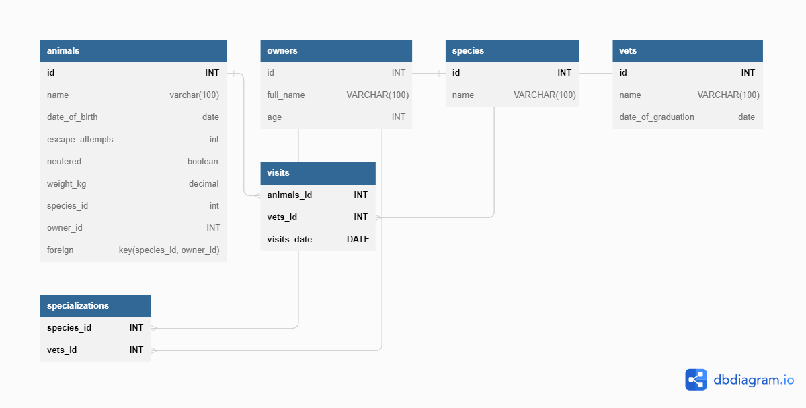

# Vet Clinic Database - Microverse Project 🐈🐕

> This Repository contains my database project. It has the commands input to create a database, create tables, edit tables as well as queries made.
> It uses the template provided by [microverse](https://github.com/microverseinc/curriculum-template-databases). 

## Getting Started

This repository includes files with plain SQL that can be used to recreate a database:

- The [schema.sql](./schema.sql) has been used to create all tables.
- The [data.sql](./data.sql) has been used to populate tables with sample data.
- The [queries.sql](./queries.sql) has examples of queries that can be run on a newly created database. **Important note: this file might include queries that make changes in the database (e.g., remove records). Use them responsibly!**

## Author

👤 **Vitor Guedes Madeira**
- GitHub: [@vitorguedesmadeira](https://github.com/VitorGuedesMadeira)
- Twitter: [@CDahguedes](https://twitter.com/CDahguedes)
- LinkedIn: (https://www.linkedin.com/in/vitor-guedes-madeira/)

## Quick view
> 

## 🤝 Contributing

Contributions, issues, and feature requests are welcome!

Feel free to check the [issues page](../../issues/).

## Show your support

Give a ⭐️ if you like this project!

## Acknowledgments

- Hat tip to anyone whose code was used
- Inspiration
- etc

## 📝 License

This project is [MIT](./MIT.md) licensed.